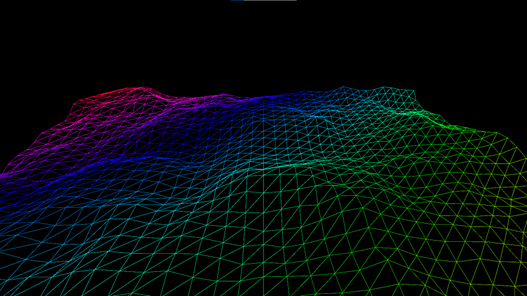

# TU856/TU858 Object Oriented Programming 2023



Teams:

[](https://teams.microsoft.com/l/meetup-join/19%3ameeting_N2M4NDdlNGEtZThkNy00NWNjLTgwZDctOGZiZjY4ZWY4YjNj%40thread.v2/0?context=%7b%22Tid%22%3a%22766317cb-e948-4e5f-8cec-dabc8e2fd5da%22%2c%22Oid%22%3a%2261aab78b-a857-4647-9668-83d4cca5de03%22%7d)

Resources
---------
- [Install the software you will need for this module](install.md)
* [The Java Tutorial from Oracle](http://docs.oracle.com/javase/tutorial/)
* [Games Fleadh](http://www.gamesfleadh.ie/)
* [The Nature of Code](http://natureofcode.com/)
* [The git manual - read the first three chapters](http://git-scm.com/documentation)
* [A video tutorial all about git/github](https://www.youtube.com/watch?v=p_PGUltnB6w)
* [The Processing language reference](http://processing.org/reference/)

## Contact the lecturer
* Email: bryan.duggan@tudublin.ie
* Web: http://bryanduggan.org

# Assessments

- [Assignments](assignments.md)

- Week 5 - Teams Submission
- 26 April - Lab Test 20% 
- 4 May Assignment Submission - 30%
- End of Year exam - 50%

# Last years course
- https://github.com/skooter500/OOP-2021-2022

# Previous Years Lab Tests
- https://github.com/skooter500/OOP-Test-2022
- https://github.com/skooter500/OOP-LabTest-2020-Starter
- https://github.com/skooter500/OOP-LabTest-2020/
- https://github.com/skooter500/OOP-Test-2019-Starter
- https://github.com/skooter500/OOP-Test-2019-Solution
- https://github.com/skooter500/OOP-2018-Lab-Test-2
- https://github.com/skooter500/OOP_Labtest1_2017_Starter
- https://github.com/skooter500/OOP-LabTest1-

# Week 10 - Bullet class, ArrayList
We added bullet firing and getting removed when the bullets go offscreen. We explored a limitation of the for-each loop
- [Recording](https://tudublin-my.sharepoint.com/:v:/g/personal/bryan_duggan_tudublin_ie/EeLy5Kfu281DoiBM-QYCH6oB47P7SJO-7H4nGFJeBxOJbw?e=WRAldo)

## Lab
Update your forks!

For some good practice, try implementing these challenges:

- Implement a fire rate, so that the number of Bullets each player can fire per second is limited and can be modified.
- Implement Bullet and Player wrap around, so that bullets and players wrap around the screen
- Implement Bullet "time-to-live" so that bullets survive for 5 seconds and then get removed. 
- Implement Bullet "fade-out" so that Bullets fade out before they get removed
- Refactor the code so that Bullet and Player extend a common super class 

Alternatively! - Work on your assignments

# Week 9 - YASC Part 1 - Encapsulation, transforms
- [Recording](https://tudublin-my.sharepoint.com/:v:/g/personal/bryan_duggan_tudublin_ie/ESDnglyD6EJMv558Z-8uqTIBB189eEicCP_nl_BloHH7Ag?e=kTwgN6)

## Lab

Try to make a subclass of Ship called AIShip that moves around the screen autonomously. You can get the AIShip to follow a path made up or an ArrayList of PVector's

Alternatively - Work on your assignment!

Here is a video:

[](https://www.youtube.com/watch?v=6qzw__ENHlA)


# Week 8 - Review Week

# Week 7 - The Game of Life
- [Recording of the class](https://tudublin-my.sharepoint.com/:v:/g/personal/bryan_duggan_tudublin_ie/EQyeIpRQ3AxPsA27SVd5CbAB7DvWjpeVJqhUAcEnYXCl1g?e=lCuvXJ)
- [Epic Conway's Game of Life](https://www.youtube.com/watch?v=C2vgICfQawE)
- [3D Game of Life](https://www.youtube.com/watch?v=dQJ5aEsP6Fs)
- [John Conway talks about the game of life](https://www.youtube.com/watch?v=FdMzngWchDk)
- [The Dream of Life](https://www.youtube.com/watch?v=wU0PYcCsL6o)

# Lab
I fixed the bugs in the Game of Life code we wrote in the class today. They are in the game_of_life_fixed branch of the repo. To get the code we wrote today and new branch into your fork, run:

```
git checkout master
git fetch upstream
git pull upstream master
```

Create a branch for the lab:

```
git checkout -b lab7
```

Use the debugging tools in VS Code to track down the bug! 

- F9 - Toggle a breakpoint
- F10 - Step over
- F11 - Step Into 
- F5 - Start the debugger

Interactive debuggers tools are essential tools for programmers.

* If you want to cheat, [the solution is here](https://github.com/skooter500/OOP-2023/commit/0106cae8a3fe7b5855aa1ad977d4e6c4224c4c44). The important line is line 35 

Your game of life should look like this (click the image for a video):

[](https://www.youtube.com/watch?v=SmH2r_ChmFY)

Some extra things you can implement:

- Increase size and change the size of the screen and see what effect this has on the simulation 
- Press space to pause and resume the simulation
- Press 1 to randomise the board again
- Press 2 to clear the board
- Press 3 to draw a cross shape and see how it evolves
- Drag the mouse across the window to set cells at the mouse position to be alive.

Some extra things you can implement that are not in the video

- Draw a glider at the mouse position. This is starting pattern that will evolve a pattern that walks across the screen
- Draw a Gosper Gun at the mouse position. This is a starting pattern that will spawn creatures indefinitely

You can read more about these starting patterns and others in [this wikipedia article](https://en.wikipedia.org/wiki/Conway%27s_Game_of_Life) and see examples in this video:

[](https://www.youtube.com/watch?v=HMYh4jKdtNU)

If you want to learn more about cellular automata check out: 

- [The Nature of Code](https://natureofcode.com/)
- [A New Kind of Science](https://writings.stephenwolfram.com/2017/05/a-new-kind-of-science-a-15-year-view/)

# Week 6 - Digital Audio 2 - Analyzing the FFT
- [Recording of the class](https://tudublin-my.sharepoint.com/:v:/g/personal/bryan_duggan_tudublin_ie/EaVOsq7ifNlNloBIg1uek9ABKkwOAbcNLygpO7U-g6zS6g?e=fW2KUb)

## Tutorial
- [Recording](https://tudublin-my.sharepoint.com/:v:/g/personal/bryan_duggan_tudublin_ie/EfIyi8xt-mFMtFdbKTxaI0EBZOMb-LGuDfwtxDW1AX7_tA?e=wMQ9i0)

## Lab

Update your forks to get the code we wrote on Monday!

When we take a frequency and get the note name for that frequency, this is called "spelling" the frequency. Here is some Java code for the frequencies of the notes in several octaves of the the D Major scale. For musicians in the class, you will know that D Major has 2 sharps. F# and C#, so the frequencies for the notes F and C are those for F# and C#

```Java
float[] frequencies = {293.66f, 329.63f, 369.99f, 392.00f, 440.00f, 493.88f, 554.37f, 587.33f
			, 659.25f, 739.99f, 783.99f, 880.00f, 987.77f, 1108.73f, 1174.66f};
	String[] spellings = {"D,", "E,", "F,", "G,", "A,", "B,", "C", "D", "E", "F", "G", "A", "B","c", "d", "e", "f", "g", "a", "b", "c'", "d'", "e'", "f'", "g'", "a'", "b'", "c''", "d''"};
```
-  Write a class called PitchSpeller that has the above 2 arrays as fields. It should have a method ```public String spell(float frequency)``` that takes a frequency as a parameter and returns the spelling which is *closest* to that frequency. Test your solution by adding code to the main method. For example:

```Java
PitchSpeller ps = new PitchSpeller();
System.out.println(ps.spell(330));
System.out.println(ps.spell(420));
System.out.println(ps.spell(1980));
```

Should print:

```
E,
A,
b
```

You can use the ```Math.abs``` method in your solution to get the absolute value of a number.

Now you can use the PitchSpeller class with the code we wrote on Monday and you will have made a simple transcription system.

Here is a video of what your finished program might look like:

[](https://youtu.be/bfLVzCD2UC0)

There is a file called scale.wav in the repo you can use to test your solution

# Week 5 - Digital Audio 1
- [Recording of the class](https://tudublin-my.sharepoint.com/:v:/g/personal/bryan_duggan_tudublin_ie/Ef00smEvputFlEtGJYTqleEBUMA-SFRxoxWUkPEnN34mPA?e=VfutXz)

## Tutorial
- [Recording](https://tudublin-my.sharepoint.com/:v:/g/personal/bryan_duggan_tudublin_ie/EWmC4bZXgFJOq8cDIQ1akmgBQhgtOkZn6FsxPABtcs8c2Q?e=OSwzeT)

### Lab
### Learning Outcomes
- Practice for loops
- Demonstrate an understanding of how digital audio works
- Practice computational thinking and problem solving
- Have fun making beautiful things 

Update your forks and have a look at Audio1.java this is the code we wrote on Monday with some modifications. Checkout the ```keyPressed``` function. This starts and restarts the audio file when you press space. Also it sets the value of the ```mode``` variable to be the numbers 0-5 when you press the appropriate key on the keyboard. If your computer wont play the audio file for some reason,you can uncomment the code to read audio from the microphone instead or use a .wav file instead.

You should make an array the same size as the buffer and lerp the samples to each element in the buffer (similar to how we did the average). This will make all your visualisations smoother

Ok now check out this video of 5 visuals you can make today. Pressing the keys 0-4 on the keyboard should change the visual in your sketch.

[](https://www.youtube.com/watch?v=xF7VrXZqLko)

- 0 - The wavy lines visual - To make this, flip the order of the x2, y2 parameters on the line
- 1 - The waveform
- 2 - The waveform drawn down the 4 sides of the screen
- 3 - The circle - Use the lerped amplitude to control the size of the circle
- 4 - The square - Again use the lerped amplitude to control the size of the square. You can also use rectMode(CENTER) to make the x and y parameters of the rect function determine the center of the rect rather than the coordinates of the top left corner
- 5 - There is no visual associated with 5 in the video, so come up with your own!


# Week 4
- [Recoding of the class](https://tudublin-my.sharepoint.com/:v:/g/personal/bryan_duggan_tudublin_ie/ESgtwCRYdVpEu2R8RmRUJMQBZA1XDVfpVZrfLEhVDeOaBg?e=23d7az) 
- I have decided to *keep* the word guys as a gender inclusive term as there is currently no good alternative

- [Recording of the tutorial](https://tudublin-my.sharepoint.com/:v:/g/personal/bryan_duggan_tudublin_ie/EZ2psbF11CBBuUnuCHCWbjsB8JFIrTLht2xtaH596LGwdA?e=Co3nBE)

## Lab 
- Update the master branches of your repos to the code we worked on in Monday's class
	```
	git checkout master
	git pull upstream master
	```

- Create a branch for your work today
	```
	git checkout -b lab4
	```
- Do some work on [the lab test from 2016](https://github.com/skooter500/OOP-LabTest1-2016/blob/master/readme.md). We started this in Monday's class, so you have some starter code.
	- Create the Star class
	- Load from the csv file into an ArrayList of Star objects
	- Plot the stars to the grid

- This is how you can load the file into an ArrayList of Star objects:

	```Java
	void loadStars()
		{
			Table table = loadTable("HabHYG15ly.csv", "header");
			for(TableRow r:table.rows())
			{
				Star s = new Star(r);
				stars.add(s);
			}
		}
	```
- You can make Constructors for Star class like this:

	```Java
	public Star(TableRow tr)
		{
			this(
				tr.getInt("Hab?") == 1, 
				tr.getString("Display Name"), 
				tr.getFloat("Distance"),
				tr.getFloat("Xg"),
				tr.getFloat("Yg"),
				tr.getFloat("Zg"),
				tr.getFloat("AbsMag")
			);
		}
		
		public Star(boolean hab, String displayName, float distance, float xG, float yG, float zG, float absMag) {
			this.hab = hab;
			this.displayName = displayName;
			this.distance = distance;
			this.xG = xG;
			this.yG = yG;
			this.zG = zG;
			this.absMag = absMag;
		}
	```
- Commit and push your changes to the repo
- Submit the URL to your repo via [this form](https://forms.office.com/Pages/ResponsePage.aspx?id=yxdjdkjpX06M7Nq8ji_V2ou3qmFXqEdGlmiD1Myl3gNUNzFGRTJMUzNKVkoxRUZGNUE1VUE2WTZBQy4u)

# Week 3
- No class because of the bank holiday
- Lots of amazing things happened in tech!

### Tutorial
- [Recording of the tutorial](https://tudublin-my.sharepoint.com/:v:/g/personal/bryan_duggan_tudublin_ie/ETZxKYxvO_JCgO8VAtE8NCkBnVPbhKHdeE5F3aiiEd95Kw?e=wYOaxB)

### Lab

What a time to be alive!

Here are three ideas for todays lab. Pick one:

- I had the idea to include git commits on forks of this repo each week as part of the grade. Making a branch for each lab and some commits each week counts towards the final mark. To do this I need a Python program that:
	- loads a csv file with student names, numbers and repo urls
	- Has a set of rules for allocating marks for commits like, creating a branch and making 5 commits each week on the branch gets a point
	- Uses the Github api to get this info for each student url
	- Outputs this to csv file
	- Make a git repo for your project and share it with me!

- If you are making a game for [Games Fleadh](https://gamesfleadh.ie/) or even if you dont plan, you should check out Godot Game Engine. Its Oh My Wow! Holy Jingle Bells. Download it watch my [classes on Godot](https://github.com/skooter500/GE2-2023) (unedited) or do some tutorials. 

- Here is a lab all about [using git](gitlab.md)

- Try these programming exercises:

Update your forks and create a branch on your repos for your work today:

Today you can edit the file Loops.java and try out these procedural drawing exercises. The variable ```mode``` will have the value of 0-9 depending on which number key is pressed. You can use it to switch the pattern being drawn:

### if statement 

- 3 exercises. Click the image for video:

[](https://www.youtube.com/watch?v=18kMOeygmHA)

### for loops:

Use a loop, rect and the HSB colour space:


Use a loop, rect and the HSB colour space:


Use a loop, rect and the HSB colour space:


Use a loop, ellipse, and the HSB colour space:


Use a loop, ellipse and the HSB color space to draw this:


Use a nested loop to draw this:


Try and draw this using ONE for loop. You will need the [text](https://processing.org/reference/text_.html) and [textAlign](https://processing.org/reference/textAlign_.html) functions:


Use a nested loop to draw this:


Use sin and cos to draw this:


Use line, sin and cos to draw regular polygons like squares, pentagons, octogons etc:


Draw a procedural star like these:


# Week 2 - Introduction to drawing with Processing libraries

## Lecture
- [Recording of the class](https://tudublin-my.sharepoint.com/:v:/g/personal/bryan_duggan_tudublin_ie/EVMza0r4Z2hFuMUml87RwMsBE5yPcc7J_UArimAKbAFWlQ?e=ePh9de) 

## Tutorial
- [Recording](https://tudublin-my.sharepoint.com/:v:/g/personal/bryan_duggan_tudublin_ie/ERXftZvs-4xJsE8KwounpAsBVd85RQAn2jMdIJ1tsrAvfA?e=VG5uBx) 

## Lab

## Learning Outcomes
- Practice drawing stuff and working out co-ordinates
- Practice using variables and if statements in Java

This is a video of a silly game called Bugzap made in Java using the Processing libraries. 

[](https://www.youtube.com/watch?v=s6PA8jtWneQ)

How you should do it:

Ok let's get the main game working first and not worry about the splash screen and the game over screen

- Update your fork of the repository from the master branch. To do this, cd to the folder where you have cloned *your* repository, (or clone it somewhere if you need to) and type:

```bash
git checkout master
git pull upstream master
```

- Create a branch for your work today by typing:

```
git checkout -b lab2
```

- Create a new class called BugZap.java in the ie.tudublin folder. Make it extend ```PApplet``` and add the ```settings```, ```setup``` and ```draw``` methods. Check out HelloProcessing2.java if you need examples for these. This class also has examples of the drawing methods with comments. You can also check out the [Processing reference]() if you are unsure about any of the methods.
- Call ```size``` in ```settings``` to set the size of the drawing window. 
- Edit the file Main.java so that it starts the BugZap class instead of the HelloProcessing2 class. I'll let you figure out how to do this :-)
- Make sure everything works by compiling and running your program before continuing!

Now we can draw the bug.

- Make fields of type ```float``` in the BugZap class for ```playerX```, ```playerY``` and ```playerWidth``` and give these default values. You can decide what these should be. There are built in variables called ```width``` and ```height``` that give the width and height of the drawing window. These only get assigned after size has been called, so if you want to use these to give values to playerX, playerY etc. put the code into the *setup* method. 
- Write a method called void ```void drawPlayer(float x, float y, float w)``` that draws the player character, centered around the parameters x, y. You can use the line method to do this. You can pass variables as parameters to this method and also things like ```x + 20```, ```w * 0.5f``` etc. I made an extra variable in this method called h for the height and set it to be half the w parameter. Don't forget to set the stroke color!
- Call this method from ```draw```, passing in the parameters playerX, playerY and playerWidth.
- Compile and run everything to make sure it's working before continuing.
- If everything is working ok, you should see the bug on the screen

Now lets get the player moving in response to the keys

Add this method to BugZap.java:

```Java
public void keyPressed()
	{
		if (keyCode == LEFT)
		{
			System.out.println("Left arrow pressed");
		}
		if (keyCode == RIGHT)
		{
			System.out.println("Right arrow pressed");
		}
		if (key == ' ')
		{
			System.out.println("SPACE key pressed");
		}
	}	
```

- If you compile and run the program again you will see that some messages get printed out when you press various keys. If you are running in Visual Studio Code, you will see these messages appear in the Debug Console
- Modify this method to increment and decrement the playerX variable instead and you should be able to get the player to move left and right
- You might want to add if statements to this method to stop the player moving off the left and right side of the screens. If statements in Java are almost the same as in C!
- When the player presses SPACE you will want to draw a line for the player's laser.

The Bug

- In a similar way to how you made the player, make the Bug. Make variables and drawBug method. Don't forget to call the method from draw()
- To move the bug you can add a random amount to it's x coordinate on intervals. To generate a random number you can use the [random](https://processing.org/reference/random_.html) function.  
- One way to make stuff happen on an interval rather than every frame is to use the frameCount variable. This variable is a field in PApplet and it gets incremented automatically every time draw is called. Because draw gets called 60 times a second, you can do something every second with this code:

```Java
if ((frameCount % 60) == 0)
{
    // Do something
}
```

- You can print text to the screen using the [text](https://processing.org/reference/text_.html) function.

Ok you should now have the basics working. See if you can figure out how to check to see if the player hits the bug, add scoring, splash screen, game over screen and sound.


# Week 1 - Introduction

## Lecture
- [Introduction Slides](https://tudublin-my.sharepoint.com/:p:/g/personal/bryan_duggan_tudublin_ie/EYXKcGlJFllBoLfJ_GjdH8ABu2OQCKyRsXuqlPqb3yXMtA?e=7hN0YC)

- [Recording of the end of the class](https://tudublin-my.sharepoint.com/:v:/g/personal/bryan_duggan_tudublin_ie/ERkxYbiWRcNPpoCuE4DuFjwB9bjvftOJeo26YQDjXm_OJA?e=Q1suyr)

## Tutorial
- [Coding Bat](https://codingbat.com/)

## Lab
## Learning outcomes
- Set up Java, Visual studio code and the Java Extensions
- Fork the repo, configure the upstream remotes
- Write your first Java code using command line tools
- Test out Visual Studio Code

## Part 1 - Installing Java

Install the software you will need for this module and set up your path to the Java Development Kit. [This document explains what you need](install.md).

## Part 2 - Forking the repo

Firstly fork *this* repository by clicking the fork button above, so that you get your own copy of the course repo to work on this semester. Now create a new empty folder on your computer somewhere right click on the folder and choose git bash here. Alternatively you can start the bash and cd to the new folder. To clone the repository for your fork:

```bash
git clone https://github.com/YOURGITUSERNAME/OOP-2023
```

Replace YOURGITUSERNAME with your github username. You can also copy the URL to the repo from your browser and paste it into the console. To paste into the bash on Windows is right click. You can use Cmd + C, Cmd + V on the Mac.

Now cd into the repo and check the origin and upstream remotes are set up correctly

```bash
cd OOP-2023
git remote -v
```

You should see something like this:

```bash
origin  https://github.com/YOURGITUSERNAME/OOP-2023 (fetch)
origin  https://github.com/YOURGITUSERNAME/OOP-2023 (push)
upstream  https://github.com/skooter500/OOP-2023 (fetch)
upstream  https://github.com/skooter500/OOP-2023 (push)
```

If you don't see the upstream remote, you can set it up by typing

```bash
git remote add upstream https://github.com/skooter500/OOP-2023
```
You can read more about forking a git repository and setting up the upstream remote in [this article](https://help.github.com/en/github/getting-started-with-github/fork-a-repo)

Once the upstream is setup, you will be able to push code to your own repo and also keep it up to date with the master branch of the changes I make each class.

If you already forked the repo before the lab, you may need to update your master branch from my master branch to get the changes I made:

```bash
git fetch
git checkout master
git pull upstream master
git push
```

## Part 3 - Compiling & running Java

Open the OOP-2023 folder in Visual Studio Code. You can run your program by choosing Run | Start Debugger. *Important for users of the Lab computers* In the labs you should use the shell scripts ```compile.sh``` and ```run.sh``` located in the Java folder to compile and run your code. You can run these from the Bash. 

You should see

```
Hello world
Tara
Tara
```

On the terminal. If you do, then congratulations! You have successfully compiled and run your first Java program. Now create a branch to store your changes today. Best not to modify the master branch so you can keep it up to date with my changes:

```bash
git checkout -b lab1
```

- Make a private ```int``` field on the Cat class called numLives.
- Write public accessors for the field (see how I did this for the name field on the Animal class)
- Set the value of this field to 9 in the Cat constructor  
- Write a method (functions are called methods in Java) on the Cat class called kill. It should subtract 1 from numLives if numLives is > 0 and print the message "Ouch!". If numLives is 0, you should just print the message "Dead"
- Create a new instance of the Cat class like this

    ```Java
    Cat ginger = new Cat("Ginger");
    ```
- In the Main class in a loop, call kill on ginger until ginger is dead.
- Compile and run your program until you have no bugs and you get the desired output.

Commit and push your changes:

```bash
git add .
git commit -m "killing the cat"
git push --set-upstream origin lab1
```

The "--set-upstream origin lab1" option is only required the first time you commit onto a new branch. After that you can just type "git push"

## Part 4 - Hello Processing

Checkout the branch HelloProcessing by typing

```
git checkout HelloProcessing from the bash
```

Press F5 and if all goes well, you should see something that looks like this:


Use the shell scripts I mentioned above if you are using a lab computer.

If you are done check out the references for classes, packages, constructors and accessors below.

Also! [Read the first three chapters of the git manual](https://git-scm.com/docs/user-manual).

## Lecture
- [Introduction slides](https://tudublin-my.sharepoint.com/:p:/g/personal/bryan_duggan_tudublin_ie/EYXKcGlJFllBoLfJ_GjdH8ABu2OQCKyRsXuqlPqb3yXMtA?e=V9lhl6)
- [hello world](java/src/ie/tudublin)
- [Classes](https://docs.oracle.com/javase/tutorial/java/concepts/class.html)
- [Packages](https://docs.oracle.com/javase/tutorial/java/package/packages.html)
- [Constructors](https://docs.oracle.com/javase/tutorial/java/javaOO/constructors.html)
- [Accessors](https://docs.oracle.com/javase/tutorial/java/javaOO/accesscontrol.html)

Some assignments from previous years:

- https://www.youtube.com/playlist?list=PL1n0B6z4e_E7Iwc8Uud1YlA_gOQXnmP3I

- https://www.youtube.com/watch?v=NGQbYEESZEg&list=PL1n0B6z4e_E7I2bIWWpH8NAa6kPx95sw5

- https://www.youtube.com/watch?v=zLXon_nlibY

- https://www.youtube.com/watch?v=vecMCz1eB1s

- https://www.youtube.com/watch?v=xlEudfLH6Fg

- https://www.youtube.com/watch?v=uykz5mCjV0w

- https://www.youtube.com/watch?v=sPjZSRCmt1U